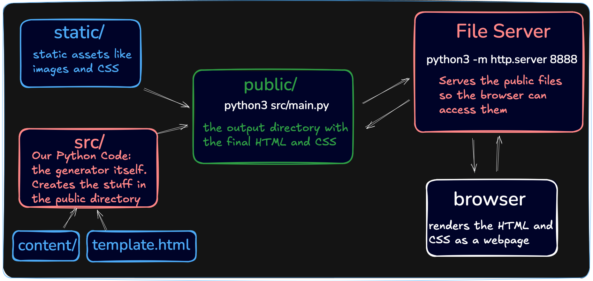

# static-generator
3 eme projet du parcour Bootdev

## Architecture 



- `/content` : contient les fichiers markdown.
- `src/` : contient le code Python pour convertir le Markdown en HTML
- `public/` : contient le HTML

## Commande
Cette commande lance le serveur Python, et rends le fichier html.
```shell
python3 -m http.server 8888 
```

Pour lancer le script depuis le root du projet, on utilise le .sh
```shell
./main.sh
```